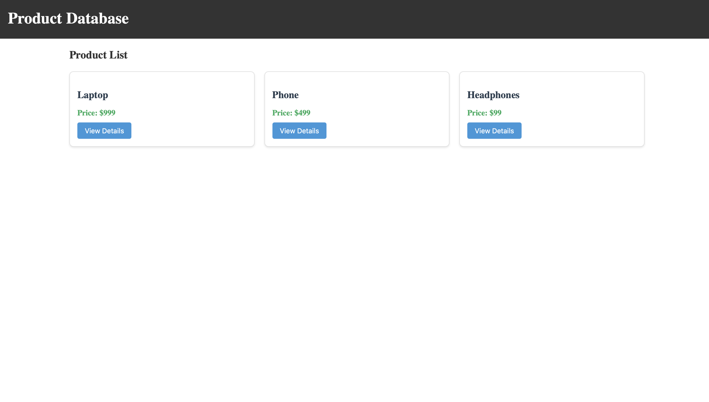
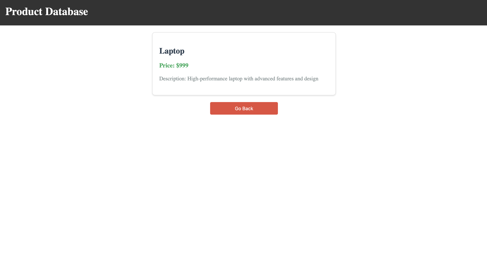

# ProductApp

This project was generated using Angular CLI version 19.2.0.
## Project Screenshots

Here are a couple of screenshots from the application:

  
*Example of the application home page (Product List).*

  
*Another view demonstrating the application interface (Product Details).*

---

## Getting Started

Follow these steps to run the project locally:

1. **Clone the Repository**  
   Open your terminal and run:  
   git clone https://github.com/nirav-jivani/product-app.git

2. **Navigate to the Project Folder**  
   cd ProductApp

3. **Install Node Modules**  
   Install all necessary dependencies by running:  
   npm install

4. **Start the Development Server**  
   Launch the application by running:  
   ng serve or npm start
   Once the server is running, open your browser and navigate to http://localhost:4200/. The application will automatically reload whenever you modify any of the source files.

---

## Building

To build the project run:

ng build

This will compile your project and store the build artifacts in the dist/ directory. By default, the production build optimizes your application for performance and speed.

---

## Running Unit Tests

To execute unit tests with the Karma test runner, use the following command:

ng test

---

## Running End-to-End Tests

For end-to-end (e2e) testing, run:

ng e2e

Angular CLI does not come with an end-to-end testing framework by default. You can choose one that suits your needs.

---

